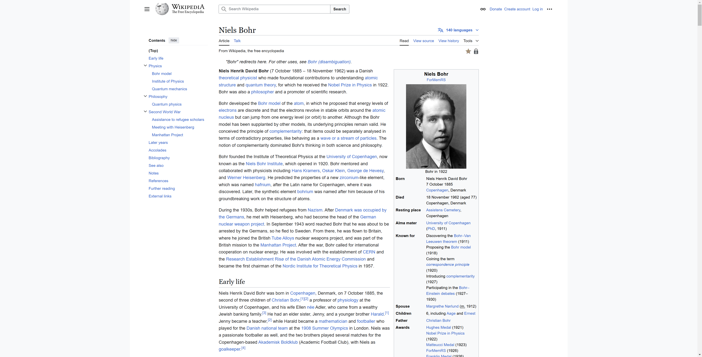
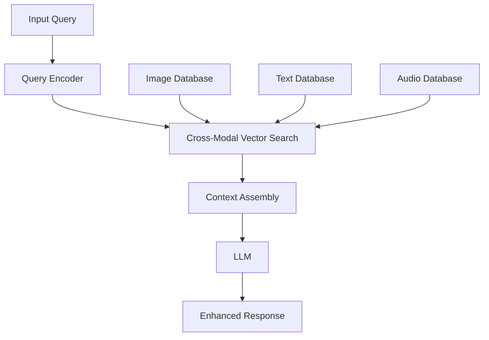

## What is RAG? {.center}

RAG = Retrieval Augmented Generation
A generative AI approach where the model combines external knowledge retrieval with text generation to provide more accurate and contextually rich responses.

## Why RAG?

- **Augments LLM responses with relevant context**: Instead of relying solely on the LLM's training data, RAG retrieves and incorporates specific, up-to-date information into responses.

- **Helps ground responses in factual information**: By providing relevant context from trusted sources, RAG ensures responses are based on actual facts rather than model-generated content.

- **Reduces hallucinations**: With access to specific, retrieved information, the model is less likely to generate incorrect or fabricated responses.

- **Enables use of private/proprietary data**: Organizations can leverage their internal documents, knowledge bases, and proprietary information that wasn't part of the LLM's training data.

- **Provides source attribution**: RAG systems can track where information comes from, making responses more transparent and verifiable.

## Simple RAG Architecture

::: {.callout}

:::

Key Components:

  - **Document Processing**: Converts raw documents into chunks and creates embeddings for efficient retrieval.
  - **Vector Storage**: Stores document embeddings and enables similarity search.
  - **Query Processing**: Converts user questions into embeddings and finds relevant documents.
  - **Response Generation**: Combines retrieved context with LLM capabilities to generate accurate answers.

## Building a Basic RAG App

1. **Prepare documents**: Clean and preprocess your source documents, removing irrelevant content and standardizing format.

2. **Create embeddings**: Convert text chunks into numerical vectors using embedding models like [BGE-large-en-v1.5](https://huggingface.co/BAAI/bge-large-en-v1.5) (available on Hugging Face), Amazon Titan embeddings, OpenAI's ada-002 or Cohere's embed-multilingual.

3. **Store in vector database**: Upload embeddings to a vector store like Pinecone, Weaviate, or FAISS for efficient similarity search.

4. **Process user query**: Convert the user's question into an embedding using the same embedding model.

5. **Retrieve relevant context**: Perform similarity search to find the most relevant document chunks.

6. **Generate response**: Combine retrieved context with an LLM prompt to generate an accurate, contextual response.

## Chunking Strategies

>Reference: [Chunking techniques with LangChain and LllamaIndex](https://blog.lancedb.com/chunking-techniques-with-langchain-and-llamaindex/)

- **Document segmentation approaches**: Choose between fixed-size chunks, semantic chunking, or paragraph-based splitting depending on your content structure.

- **Chunk size considerations**: Balance between too large (dilutes relevance) and too small (loses context) - typically 256-1024 tokens works well.

- **Overlap between chunks**: Include some overlap (10-20%) between consecutive chunks to maintain context across boundaries.

- **Maintaining context**: Preserve important metadata and hierarchical information when splitting documents.

- **Structured vs unstructured data**: Adapt chunking strategy based on whether you're dealing with free text, tables, or structured documents.

## Embeddings Deep Dive

Key Considerations:

  - **Model selection criteria**: Consider factors like accuracy, speed, cost, and dimension size when choosing an embedding model.

  - **Dimensionality impact**: Higher dimensions can capture more information but increase storage costs and retrieval time.

  - **Multi-lingual support**: Choose models like Cohere multilingual or Amazon Titan if your application needs to handle multiple languages.

  - **Domain-specific needs**: Consider fine-tuning embedding models for specialized domains like medical or legal text. Finet-tuning using [Sentence Transformers](https://huggingface.co/blog/train-sentence-transformers).

## Popular Embeddings Models

  - **Hugging Face**: Huge collection of embeddings models available
  - **OpenAI embeddings**: Excellent general-purpose performance but can be expensive for large-scale applications.
  - **Cohere embeddings**: Strong multilingual support and competitive performance.
  - **Amazon Titan**: Integrated well with AWS ecosystem, good multilingual capabilities.
  - **Voyage AI**: Recommended by Anthropic, state-of-the-art performance with domain-specific models for finance, healthcare, and code.
  - **ColBERTv2**: Late interaction model -- independently encodes queries and documents, then uses "MaxSim" for fine-grained token-level similarity. 6-10x smaller footprint than ColBERTv1 with better quality. [Paper](https://arxiv.org/pdf/2112.01488), [HuggingFace](https://huggingface.co/colbert-ir/colbertv2.0), [LangChain example](https://python.langchain.com/docs/integrations/retrievers/ragatouille/).

---

## Beyond Embeddings: Agentic Search {.center}

What if embeddings-based RAG is not the best approach for every use case?

---

## The Case Against Embeddings-Only RAG

The Anthropic engineering team discovered that for **Claude Code**, using Unix tools (`grep`, `ripgrep`, `find`) over codebases gives **better results** than embeddings-based approaches.

> "We did use vector embeddings initially. They're really tricky to maintain because you have to continuously re-index... Claude is really good at agentic search. You can get to the same accuracy level with agentic search and it's just a much cleaner deployment story."
>
> -- Cat Wu, PM for Claude Code ([Latent Space Podcast](https://www.latent.space/p/claude-code))

Boris Cherny (Lead Engineer, Claude Code) described the tool as **"not a product as much as it's a Unix utility"** -- fitting Anthropic's product principle of **"do the simple thing first."**

---

## Agentic Search vs Semantic Search

From [Anthropic's official engineering blog](https://www.anthropic.com/engineering/claude-code-best-practices):

> "Semantic search is usually faster than agentic search, but **less accurate, more difficult to maintain, and less transparent**. It involves 'chunking' the relevant context, embedding these chunks as vectors, and then searching for concepts by querying those vectors. Given its limitations, we suggest **starting with agentic search**, and only adding semantic search if you need faster results or more variations."

**Agentic search** = An AI agent iteratively uses tools like `grep`, `find`, `cat`, and `ls` to locate relevant information, reasoning about what to search for next based on what it has found so far.

---

## SWE-Bench Validation

Colin Flaherty (Augment, top of SWE-Bench Verified leaderboard):

> "We explored adding various embedding-based retrieval tools, but found that for SWE-Bench tasks this was **not the bottleneck** -- **grep and find were sufficient**."

Source: [Why Grep Beat Embeddings in Our SWE-Bench Agent](https://jxnl.co/writing/2025/09/11/why-grep-beat-embeddings-in-our-swe-bench-agent-lessons-from-augment/)

### When Does Each Approach Win?

| Approach | Best For |
|----------|----------|
| **Agentic Search** (grep/find) | Codebases, structured text, precise lookups |
| **Semantic Search** (embeddings) | Large unstructured corpora, fuzzy matching |
| **Hybrid** (both as tools) | Agent chooses the right tool per query |

The takeaway: expose **both** as tools and let the agent decide.

---

## Contextual Retrieval {.center}

Solving the "lost context" problem in chunking

Source: [Anthropic Blog - Contextual Retrieval](https://www.anthropic.com/news/contextual-retrieval)

---

## The Problem with Naive Chunking

Traditional RAG chunks documents and embeds each chunk independently. This **loses context**:

```
Original document:
"Acme Corp revenue grew 15% in Q3. The company attributed
this growth to their new AI product line launched in Q2."

Chunk 2 (after splitting):
"The company attributed this growth to their new AI product line
launched in Q2."
```

**Problem**: Which company? What growth? The chunk is orphaned from its context.

---

## Contextual Retrieval: The Solution

Anthropic's approach: use Claude to **prepend chunk-specific context** to each chunk before embedding.

```
Contextual Chunk 2:
"This chunk is from Acme Corp's Q3 earnings report. It discusses
revenue growth of 15%. The company attributed this growth to
their new AI product line launched in Q2."
```

### Results

- **49% reduction** in failed retrievals with contextual embeddings alone
- **67% reduction** when combined with reranking
- Uses **prompt caching** to keep costs manageable (pennies per document)

### Key Insight

For knowledge bases under **200K tokens**, you may not need RAG at all -- just put the entire context in the prompt window.

---

## Late Chunking

An alternative approach from Jina AI to preserve context during chunking.

**Traditional approach** (chunk-then-embed):

```
Document -> Split into chunks -> Embed each chunk independently
```

**Late chunking** (embed-then-chunk):

```
Document -> Feed entire doc into long-context embedding model
         -> Get token-level embeddings WITH full context
         -> THEN split into chunks
```

### Why It Matters

- Pronouns and references retain their meaning ("The company" knows it means "Acme Corp")
- Each chunk embedding is aware of the full document context
- No need for an extra LLM call (unlike contextual retrieval)
- Trade-off: requires a long-context embedding model

Source: [Late Chunking Paper (arXiv:2409.04701)](https://arxiv.org/pdf/2409.04701), [Weaviate Blog](https://weaviate.io/blog/late-chunking)

---

## Hybrid Search: BM25 + Embeddings

The production standard for enterprise RAG combines **lexical** and **semantic** search.

```
                    User Query
                    /        \
                   /          \
            BM25 Search    Vector Search
           (keyword match)  (semantic match)
                   \          /
                    \        /
              Reciprocal Rank Fusion (RRF)
                       |
                  Merged Results
                       |
                   Reranker
                       |
                  Final Results
```

### Why Hybrid?

- **BM25 alone** misses semantic similarity ("car" vs "automobile")
- **Embeddings alone** miss exact keyword matches (product IDs, error codes, names)
- **Together**: best of both worlds

Recommended starting weight: **30% BM25 / 70% embedding** (tune for your domain).

Source: [Superlinked - Optimizing RAG with Hybrid Search](https://superlinked.com/vectorhub/articles/optimizing-rag-with-hybrid-search-reranking)

## Vector Databases

Features to Consider:

  - **Scalability**: Ability to handle millions or billions of vectors efficiently.

  - **Query performance**: Fast similarity search with support for approximate nearest neighbors (ANN) algorithms.

  - **Similarity search algorithms**: Support for different distance metrics (cosine, euclidean) and indexing methods.

  - **Metadata filtering**: Ability to combine vector similarity search with metadata filters.

  - **Cost considerations**: Balance between hosting costs, query costs, and storage requirements.

## Examples of Vector Databases

- **Pinecone**: 
  - Scalable and high-performance vector database.
  - Designed for real-time search with high availability and easy integration.
  - Offers fully managed services with automatic scaling and monitoring.

- **Weaviate**: 
  - Open-source vector search engine with support for hybrid search (text + vector).
  - Schema-free or schema-driven, flexible for various data types.
  - Built-in ML model hosting and extensible through modules like transformers.

- **Milvus**: 
  - Cloud-native vector database optimized for high-throughput and low-latency vector retrieval.
  - Open-source with strong community support and enterprise-grade features.
  - Supports massive-scale data management for AI and analytics applications.


## Examples of Vector Databases (contd.)

- **Qdrant**: 
  - Feature-rich, open-source vector database with support for filtering and hybrid search.
  - Integrates easily with other tools like LangChain and Python.
  - Designed for both small-scale and production-grade deployments.

- **Vespa**: 
  - A scalable engine supporting full-text, vector, and structured data search.
  - Highly customizable ranking functions for advanced retrieval tasks.
  - Enterprise-grade features, including sharding and high-availability.

- **Redis (with RedisAI)**: 
  - Extends Redis key-value store to support vector similarity search.
  - Real-time capabilities with minimal latency and optional AI integration.
  - Excellent choice for lightweight applications or adding vector search to existing Redis setups.

## Examples of Vector Databases (contd.)

- **FAISS (by Meta AI)**: 
  - A library rather than a traditional database, optimized for similarity search and clustering.
  - Ideal for applications requiring high-speed vector operations on dense datasets.
  - Limited to in-memory computation but extremely efficient.

- **OpenSearch**: 
  - Open-source search and analytics platform with vector search support using k-NN.
  - Enables hybrid search across text, vector embeddings, and metadata.
  - Strong integration with Elasticsearch and big data ecosystems.

- **Chroma**: 
  - Lightweight and developer-friendly embedding store.
  - Designed for rapid prototyping and easy integration with LLM applications.
  - Optimized for smaller-scale use cases but growing in capabilities.

- **PostgreSQL (with pgvector)**: 
  - Extends PostgreSQL to store and retrieve high-dimensional vector embeddings.
  - Leverages PostgreSQL's powerful query capabilities, indexes, and extensions.
  - Suitable for teams already using PostgreSQL for traditional relational data.


## **Review: Introduction to RAG & Architecture**

### **Building a Basic RAG App**
1. **Prepare documents** → Clean and preprocess content.
2. **Create embeddings** → Use models like BGE, OpenAI, Titan, Cohere.
3. **Store in vector DB** → Pinecone, FAISS, Weaviate, etc.
4. **Retrieve relevant context** → Use similarity search.
5. **Generate response** → Combine retrieved content with LLM prompts.

---

## **Review: Key Techniques & RAG Ecosystem**

### **Key Techniques in RAG**
- **Chunking Strategies**: Fixed-size, semantic, paragraph-based; balance size and overlap (10-20%).
- **Embeddings Considerations**: Model selection (accuracy, cost, multilingual), dimensionality trade-offs, fine-tuning for domains.
- **Query Processing**: Query rewriting, hybrid search (semantic + lexical), entity extraction.
- **Evaluation Metrics**: MRR, Precision, Recall, NDGC.

### **Vector Databases**
- **Popular options**: Pinecone, Weaviate, FAISS, Milvus, Qdrant, RedisAI.
- **Selection criteria**: Scalability, latency, dimensionality support, metadata filtering.

---

## **Review: Key Techniques & RAG Ecosystem**


### **RAG Pipelines & Tools**
- **LangChain, LlamaIndex, Haystack**: Modular frameworks for building RAG applications.
- **Amazon Bedrock Knowledge Bases**: Managed service for scalable RAG deployment.

---

## Moving beyond semantic similarity

- **Retrieval-Augmented Generation (RAG)** enhances LLM responses by retrieving external knowledge.
- Three primary approaches:
  - **Vector Database RAG** (Vector RAG)
  - **Graph-based RAG** (Graph RAG)
  - **Structured Data RAG** (SQL RAG).

---

## Vector DB RAG: Overview

- Stores knowledge as **high-dimensional vectors**
- Uses **embedding-based similarity search**
- Common libraries: FAISS, ChromaDB, Weaviate
- Strengths:
  - Fast approximate nearest neighbor (ANN) search
  - Scales well with large corpora
  - Ideal for **unstructured text retrieval**

---

## Graph RAG: Overview

- Represents knowledge as **entities and relationships**
- Uses **graph traversal and structured queries**
- Common tools: Neo4j, Memgraph, Amazon Neptune
- **Microsoft GraphRAG**: Open-source framework that extracts knowledge graphs from documents, builds community hierarchies, and generates summaries for retrieval. Outperforms baseline RAG for global sensemaking over 1M+ token datasets.
- Strengths:
  - Captures **contextual relationships**
  - Enables **logical reasoning** over data
  - Ideal for **structured, interconnected knowledge**
  - More **comprehensive and diverse** answers with fewer hallucinations

Source: [Microsoft GraphRAG](https://www.microsoft.com/en-us/research/project/graphrag/), [Paper (arXiv:2404.16130)](https://arxiv.org/abs/2404.16130)

---

## Key Differences

| Feature          | Vector DB RAG               | Graph RAG                 |
|-----------------|----------------------------|---------------------------|
| **Storage**     | Dense embeddings (vectors) | Nodes & relationships     |
| **Retrieval**   | Nearest neighbor search    | Graph traversal queries   |
| **Scalability** | Efficient for large text   | More complex, depends on structure |
| **Context**     | Semantic similarity only   | Rich, structured context  |
| **Use Case**    | Unstructured knowledge     | Structured reasoning      |

---

## When to Use Which?

### **Use Vector DB RAG When:**

- ✅ Dealing with **unstructured text** (articles, docs)
- ✅ Need **fast similarity search**
- ✅ No need for explicit relationships

### **Use Graph RAG When:**
- ✅ Need **explicit relationships & context**
- ✅ Want to model **causality & dependencies**
- ✅ Working with **structured knowledge graphs**

---

## Key Benefits of Graph RAG Over Vector RAG

- Let's explore this with an example, consider the Wikipedia entry for [`Niels Bohr`](https://en.wikipedia.org/wiki/Niels_Bohr). 
- This page has a lot of highly connected data such as where was Bohr born, where did he study, what did he discover, whom did he collaborate with.
- Using a vector db to find related information is not efficient.



--- 

## Graph RAG with an example

- ✅ 1. Structured, Relationship-Based Knowledge Retrieval
  - Graph RAG: Directly retrieves meaningful relationships instead of relying on semantic similarity.
  - Example: "Who were Bohr’s collaborators, and what did they work on together?"
  - Graph: `MATCH (p:Person {id: "Bohr"})-[:COLLABORATED_WITH]->(collaborator) RETURN collaborator.id`
  - Vector DB: Needs indirect keyword-based similarity, making it less precise.

- ✅ 2. Multi-Hop Reasoning for Deep Context
  - Graph RAG: Finds indirect connections across multiple hops.
  - Example: "Who was Bohr’s mentor's mentor?"
  - Graph: `MATCH (p:Person {id: "Bohr"})-[:STUDY_UNDER*2]->(mentor) RETURN mentor.id`
  - Vector DB: Needs recursive similarity searches, which are inefficient.

--- 

## Graph RAG with an example

- ✅ 3. More Explainable and Trustworthy
  - Graph RAG: Results can be traced back to explicit relationships.
  - Vector RAG: Results are based on black-box similarity (hard to explain why a result was retrieved).
  - Example: If asked, “Why was this document retrieved?”, Graph RAG can explicitly show relationships.

- ✅ 4. Query Flexibility: More Than Just Similarity
  - Graph RAG: Supports specific, structured queries (e.g., "Who studied at the same university as Bohr?").
  - Vector RAG: Can only find conceptually similar documents, not structured relationships.

- ✅ 5. More Efficient for Small, Highly Connected Datasets
   - Graph RAG: Efficient when data has explicit relationships (e.g., scientific collaboration networks).
   - Vector RAG: More useful for large, unstructured text collections (e.g., generic documents, news).

---

## Example: Finding Relevant Information

The vector search for this would have to include potentially several chunks of text and may still not get all the collaborators whereas the graph retrieval would be deterministic and more accurate.

### **Vector DB RAG Query** (FAISS)
```python
retriever = vectorstore.as_retriever()
retriever.get_relevant_documents("Who all did Bohr collaborate with?")
```

### **Graph RAG Query** (Cypher for Memgraph)

```cypher
MATCH (p:Person {id: "Bohr"})-[:COLLABORATED_WITH]->(collaborator)
 RETURN collaborator.id;
```


---

## SQL RAG: Structured Data Retrieval

- Uses **relational databases (e.g., MySQL, PostgreSQL)** as the knowledge base.
- Retrieves information using **SQL queries** instead of vector similarity or graph traversal.
- Best for **highly structured, tabular data**.
- Example query: we want to find the average trip distance on a given day from our favorite NYC TLC dataset, now this is a question that neither a vector db nor a graph db can answer.

```{.python}
SELECT AVG(trip_distance) AS avg_trip_distance
FROM nyc_taxi_data
WHERE DATE(tpep_pickup_datetime) = '2024-12-11';

```

- Works well when LLMs can generate SQL queries dynamically based on natural language input.

## LangChain Connectors for SQL Databases

- **LangChain** provides integrations for querying SQL databases with LLMs.
- Supported databases:
  - MySQL
  - PostgreSQL
  - SQLite
  - Microsoft SQL Server

---

## LangChain Connectors for SQL Databases


```python
from langchain.sql_database import SQLDatabase
from langchain.chains import SQLDatabaseChain
from langchain_aws import ChatBedrockConverse
import boto3

# Initialize Bedrock client
bedrock = boto3.client(
    service_name='bedrock-runtime',
    region_name='us-east-1'  # replace with your region
)

# Initialize the LLM
llm = ChatBedrockConverse(
    model_id="anthropic.claude-sonnet-4-20250514-v1:0",
    client=bedrock,
    model_kwargs={"temperature": 0}
)

# Connect to database
db = SQLDatabase.from_uri("sqlite:///example.db")

# Create the chain
sql_chain = SQLDatabaseChain.from_llm(llm=llm, database=db, verbose=True)

# Run the query
sql_chain.run("What are the top 5 research topics?")
```

- Enables **natural language to SQL translation** for intelligent retrieval from structured datasets.

---

## Summary of different types of RAG on text data

- **Vector DB RAG** --> Best for **scalable, unstructured text search**
- **Graph RAG** --> Best for **structured reasoning & entity relationships**
- **SQL RAG** --> Best for **highly structured, tabular data**
- **Hybrid RAG** --> Best of all approaches!

---

## Agentic RAG {.center}

Moving from static pipelines to autonomous retrieval agents

---

## What is Agentic RAG?

Traditional RAG follows a **fixed pipeline**: retrieve, then generate. Agentic RAG embeds **autonomous AI agents** that make decisions at each step.

```
Traditional RAG:
  Query -> Retrieve -> Generate -> Done

Agentic RAG:
  Query -> Agent decides what to fetch
       -> Agent calls tools (search, SQL, API, grep)
       -> Agent evaluates results
       -> Agent decides: enough? or search again?
       -> Agent may rewrite query and retry
       -> Agent generates answer with citations
       -> Agent self-checks for hallucinations
```

### Key Capabilities

- **Query planning**: Decomposes complex questions into sub-queries
- **Tool selection**: Chooses between vector search, keyword search, SQL, APIs
- **Self-correction**: Evaluates retrieved documents and retries if quality is low
- **Multi-step reasoning**: Chains multiple retrieval steps for complex questions

Source: [Agentic RAG Survey (arXiv:2501.09136)](https://arxiv.org/abs/2501.09136)

---

## Agentic RAG Architecture

```
                    +-------------------+
                    |   User Question   |
                    +--------+----------+
                             |
                    +--------v----------+
                    |   Planning Agent  |
                    | (decompose query) |
                    +--------+----------+
                             |
              +--------------+--------------+
              |              |              |
     +--------v---+  +------v-----+  +-----v------+
     | Vector     |  | Keyword    |  | SQL        |
     | Search     |  | Search     |  | Query      |
     +--------+---+  +------+-----+  +-----+------+
              |              |              |
              +--------------+--------------+
                             |
                    +--------v----------+
                    | Evaluation Agent  |
                    | (assess quality)  |
                    +--------+----------+
                             |
                     Good enough? --NO--> Rewrite & Retry
                             |
                            YES
                             |
                    +--------v----------+
                    | Generation Agent  |
                    | (answer + cite)   |
                    +-------------------+
```

---

## Corrective RAG (CRAG)

CRAG adds a **retrieval evaluator** that assesses document quality before generation.

### How It Works

1. Retrieve documents as usual
2. A lightweight evaluator scores each document: **Correct / Incorrect / Ambiguous**
3. Based on the assessment:
   - **Correct**: Refine and use the document
   - **Incorrect**: Discard and fall back to **web search**
   - **Ambiguous**: Combine refined document with web search results

### Why It Matters

- **Plug-and-play**: Works with any existing RAG pipeline
- **Self-correcting**: Does not blindly trust retrieved documents
- **Web search fallback**: Handles cases where local knowledge base is insufficient

Source: [CRAG Paper (arXiv:2401.15884)](https://arxiv.org/abs/2401.15884), [LangGraph CRAG Tutorial](https://langchain-ai.github.io/langgraph/tutorials/rag/langgraph_crag/)

---

## Self-RAG

Self-RAG teaches the model to **reflect** during generation, dynamically deciding when and what to retrieve.

### Self-RAG Process

```
Input query
  |
  v
Should I retrieve? (reflection token)
  |
  YES --> Retrieve documents
  |         |
  |         v
  |       Is this document relevant? (reflection token)
  |         |
  |        YES --> Generate with this evidence
  |         |         |
  |         |         v
  |         |       Is my response supported? (reflection token)
  |         |         |
  |         |        YES --> Return response
  |         |         NO --> Try next document
  |         |
  |        NO --> Skip this document
  |
  NO --> Generate without retrieval
```

### CRAG + Self-RAG Together

- **CRAG** cleans the retrieval inputs (better documents in)
- **Self-RAG** refines the generation outputs (better answers out)
- Complementary approaches that can be combined

---

## RAG vs Long Context Windows {.center}

With context windows reaching 200K+ tokens, is RAG still necessary?

---

## RAG vs Long Context: The Trade-offs

| Factor | RAG | Long Context |
|--------|-----|-------------|
| **Cost per query** | ~$0.00008 | ~$0.10 (1,250x more) |
| **Query latency** | ~1 second | ~45 seconds |
| **Accuracy (QA benchmarks)** | Good | Slightly better |
| **Scales to millions of docs** | Yes | No |
| **"Lost in the Middle" problem** | Minimal | Significant |
| **Requires indexing pipeline** | Yes | No |
| **Real-time data updates** | Easy | Requires re-prompting |

Source: [Long Context vs. RAG for LLMs (arXiv:2501.01880)](https://arxiv.org/abs/2501.01880)

---

## The "Lost in the Middle" Problem

Research shows that LLMs with long context windows tend to **pay more attention to the beginning and end** of the context, while information in the middle gets lower attention.

```
Attention Distribution in Long Context:

High  |##                              ##
      |###                            ###
      |####                          ####
      |#####                        #####
      |######                      ######
      |########                  ########
Low   |############        ############
      +-----------------------------------
       Beginning    Middle         End
```

RAG mitigates this by retrieving only the **most relevant** chunks, keeping the context window focused and small.

---

## When to Use Which Approach

### Use RAG When:

- Knowledge base is **larger than the context window**
- You need **real-time updates** (new documents added frequently)
- **Cost matters** (RAG is 1,000x+ cheaper per query)
- You need **source attribution** and traceability
- Working with **millions of documents**

### Use Long Context When:

- Entire corpus fits in the context window (< 200K tokens)
- You need the model to reason **across the entire document**
- Summarization or analysis of a **single long document**
- Prototyping before building a full RAG pipeline

### The Answer: Context Engineering

The field is moving toward **context engineering** -- dynamically assembling the most effective context per query, mixing RAG retrieval, long context, and cached context as appropriate.

---

## RAG Evaluation with RAGAS {.center}

How do you know if your RAG pipeline is actually working?

---

## RAGAS: RAG Assessment Framework

[RAGAS](https://docs.ragas.io/en/stable/) is the industry-standard open-source framework for evaluating RAG pipelines.

### Core Metrics

| Metric | What It Measures |
|--------|-----------------|
| **Context Precision** | Are the retrieved documents actually relevant? |
| **Context Recall** | Did we retrieve all the relevant documents? |
| **Faithfulness** | Is the generated answer supported by the retrieved context? |
| **Answer Relevancy** | Does the answer actually address the question? |

### The Key Insight

RAG evaluation requires measuring **two separate things**:

1. **Retrieval quality**: Did we find the right documents? (Context Precision + Recall)
2. **Generation quality**: Did we produce a good answer from those documents? (Faithfulness + Relevancy)

A RAG system can fail at either stage -- good retrieval with bad generation, or bad retrieval with good generation.

---

## RAGAS in Practice

```python
from ragas import evaluate
from ragas.metrics import (
    context_precision,
    context_recall,
    faithfulness,
    answer_relevancy
)

# Prepare evaluation dataset
eval_dataset = {
    "question": ["What is the capital of France?"],
    "answer": ["The capital of France is Paris."],
    "contexts": [["Paris is the capital and largest city of France."]],
    "ground_truth": ["Paris is the capital of France."]
}

# Run evaluation
results = evaluate(
    dataset=eval_dataset,
    metrics=[
        context_precision,
        context_recall,
        faithfulness,
        answer_relevancy
    ]
)

print(results)
# {'context_precision': 1.0, 'context_recall': 1.0,
#  'faithfulness': 1.0, 'answer_relevancy': 0.98}
```

### Other Evaluation Tools

- **DeepEval**: pytest-integrated RAG evaluation
- **Giskard**: ML model testing including RAG
- **LangSmith**: End-to-end LLM application monitoring

Source: [RAGAS Paper (arXiv:2309.15217)](https://arxiv.org/abs/2309.15217), [RAGAS Documentation](https://docs.ragas.io/en/stable/)

---

## Amazon Bedrock Knowledge Bases {.center}

Fully managed RAG as a service

---

## Amazon Bedrock Knowledge Bases

A fully managed service that handles the entire RAG pipeline -- from document ingestion to retrieval-augmented generation.

### Key Features

- **Advanced chunking**: Semantic, hierarchical, and fixed-size chunking strategies
- **Multiple vector stores**: Aurora PostgreSQL, OpenSearch Serverless, Neptune, MongoDB Atlas, Pinecone, Redis Enterprise
- **GraphRAG support**: Uses Neptune Analytics for knowledge graph-based retrieval (GA March 2025)
- **Multimodal retrieval**: Supports images, audio, and video alongside text
- **Contextual retrieval**: Integrates Anthropic's contextual retrieval technique

### APIs

- **RetrieveAndGenerate**: End-to-end RAG in a single API call
- **Retrieve**: Get relevant chunks without generation (bring your own LLM)

Source: [Amazon Bedrock Knowledge Bases](https://aws.amazon.com/bedrock/knowledge-bases/), [Documentation](https://docs.aws.amazon.com/bedrock/latest/userguide/knowledge-base.html)

---

## Multimodal RAG: Beyond Text

### What is Multimodal RAG?

- Traditional RAG (Retrieval-Augmented Generation) enhances LLM responses by retrieving relevant text documents
- Multimodal RAG extends this to include images, audio, video, and other data formats
- Enables LLMs to ground responses in multi-format knowledge sources

---

## Multimodal RAG: Key Components

### Vector Stores
- Specialized embeddings for different modalities
- Cross-modal similarity search
- Efficient indexing of heterogeneous data

### Embedding Models
- CLIP for image-text embeddings
- Whisper for audio-text conversion
- Domain-specific models for specialized data types

---

## Architecture Deep Dive



## Implementation Challenges

1. Modal Alignment
   - Ensuring coherent representation across modalities
   - Handling modality-specific nuances
   - Balancing retrieval across different data types

2. Performance Considerations
   - Embedding computation overhead
   - Storage requirements for multi-modal vectors
   - Retrieval latency management

---

## Real-World Applications

### Healthcare
- Medical imaging + clinical notes
- Patient history + diagnostic images
- Treatment protocols + procedural videos

### E-commerce
- Product images + descriptions
- Customer reviews + product photos
- Usage tutorials + documentation

---

## Best Practices

1. Data Preprocessing
   - Standardize input formats
   - Quality filters for each modality
   - Balanced representation

2. Retrieval Strategy
   - Modal-specific relevance scoring
   - Hybrid retrieval approaches
   - Context window optimization

---

## Evaluation Metrics

| Metric | Description |
|--------|-------------|
| Cross-Modal Relevance | Alignment between retrieved items across modalities |
| Response Coherence | Integration of multi-modal information in outputs |
| Retrieval Latency | Time to fetch and process multi-modal context |
| Memory Usage | Resource requirements for different modalities |

---

## Future Directions

### Research Opportunities
- Zero-shot cross-modal transfer
- Efficient multi-modal indexing
- Context compression techniques

### Emerging Applications
- Multimodal reasoning
- Cross-modal fact verification
- Interactive learning systems

---

## References & Further Reading

### Retrieval Approaches

1. [Anthropic Engineering: Claude Code Best Practices (Agentic Search)](https://www.anthropic.com/engineering/claude-code-best-practices)
1. [Latent Space Podcast: Claude Code](https://www.latent.space/p/claude-code) -- Cat Wu and Boris Cherny on grep vs embeddings
1. [Why Grep Beat Embeddings in Our SWE-Bench Agent](https://jxnl.co/writing/2025/09/11/why-grep-beat-embeddings-in-our-swe-bench-agent-lessons-from-augment/)
1. [Anthropic Blog: Contextual Retrieval](https://www.anthropic.com/news/contextual-retrieval)
1. [Late Chunking Paper (arXiv:2409.04701)](https://arxiv.org/pdf/2409.04701)
1. [Weaviate: Late Chunking](https://weaviate.io/blog/late-chunking)
1. [Superlinked: Optimizing RAG with Hybrid Search & Reranking](https://superlinked.com/vectorhub/articles/optimizing-rag-with-hybrid-search-reranking)

### Advanced RAG Techniques

1. [Agentic RAG Survey (arXiv:2501.09136)](https://arxiv.org/abs/2501.09136)
1. [Corrective RAG Paper (arXiv:2401.15884)](https://arxiv.org/abs/2401.15884)
1. [LangGraph CRAG Tutorial](https://langchain-ai.github.io/langgraph/tutorials/rag/langgraph_crag/)
1. [Microsoft GraphRAG](https://www.microsoft.com/en-us/research/project/graphrag/) and [Paper (arXiv:2404.16130)](https://arxiv.org/abs/2404.16130)
1. [ColBERTv2 Paper (arXiv:2112.01488)](https://arxiv.org/abs/2112.01488)
1. [Long Context vs. RAG (arXiv:2501.01880)](https://arxiv.org/abs/2501.01880)

### RAG Evaluation

1. [RAGAS Documentation](https://docs.ragas.io/en/stable/) and [Paper (arXiv:2309.15217)](https://arxiv.org/abs/2309.15217)
1. [Chunking Techniques with LangChain and LlamaIndex](https://blog.lancedb.com/chunking-techniques-with-langchain-and-llamaindex/)

### Amazon Bedrock & AWS

1. [Amazon Bedrock Knowledge Bases](https://aws.amazon.com/bedrock/knowledge-bases/)
1. [Amazon Bedrock Knowledge Bases Documentation](https://docs.aws.amazon.com/bedrock/latest/userguide/knowledge-base.html)
1. [Amazon Bedrock Knowledge Bases GraphRAG](https://aws.amazon.com/blogs/machine-learning/build-graphrag-applications-using-amazon-bedrock-knowledge-bases/)
1. [Contextual Retrieval with Amazon Bedrock Knowledge Bases](https://aws.amazon.com/blogs/machine-learning/contextual-retrieval-in-anthropic-using-amazon-bedrock-knowledge-bases/)
1. [Talk to Your Slide Deck (Multimodal RAG)](https://aws.amazon.com/blogs/machine-learning/talk-to-your-slide-deck-using-multimodal-foundation-models-hosted-on-amazon-bedrock-and-amazon-sagemaker-part-1/)

### Multimodal RAG

1. [Multimodal Few-Shot Learning with Frozen Language Models](https://arxiv.org/pdf/2106.13884)
1. [CLIP: Learning Transferable Visual Models From Natural Language](https://cdn.openai.com/papers/Learning_Transferable_Visual_Models_From_Natural_Language.pdf)
1. [Multimodal Chain-of-Thought Reasoning](https://arxiv.org/pdf/2302.00923)

### Course Resources

1. [Course Bookmarks: RAG](https://github.com/gu-dsan6725/bookmarks/tree/main?tab=readme-ov-file#rag)
