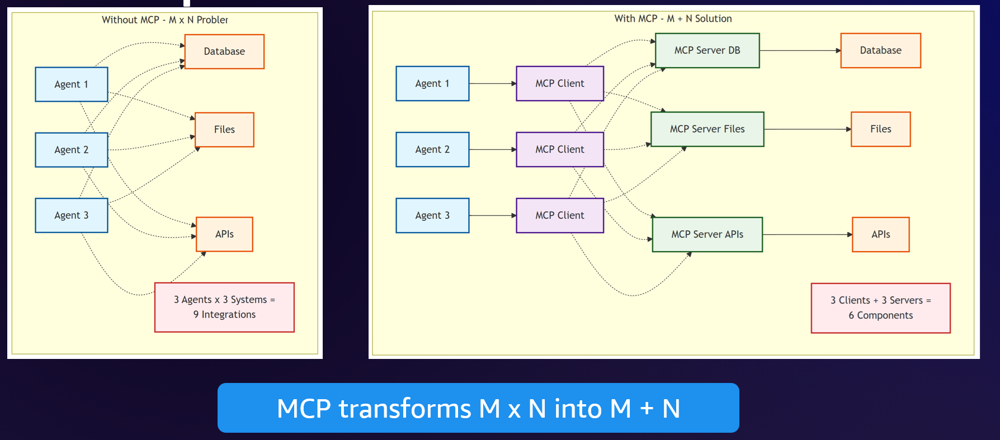
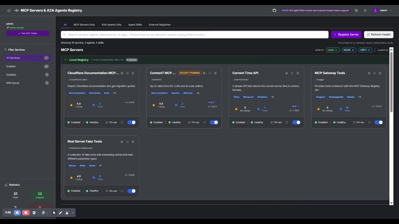

## Model Context Protocol (MCP) {.center}

A standardized protocol for connecting AI models with external tools and data sources

---

## What is MCP?

- **Model Context Protocol (MCP)**: An open protocol that standardizes how AI applications connect to external data sources and tools

- **Created by Anthropic**: Released in November 2024, now an open source project hosted by The Linux Foundation

- **Universal Standard**: Like USB-C for AI -- one protocol to connect any AI to any tool

- **Key Benefit**: Build once, use everywhere -- no more custom integrations for each AI application

---

## MCP Architecture Overview

::: {.callout}

:::

MCP exposes three core primitives to AI agents:

- **Resources**: Data sources (databases, files, enterprise search, user data)
- **Tools**: Executable functions (APIs for orders, pricing, shipping, products)
- **Prompts**: Pre-defined templates (email building, code explanation, task decomposition)

---

## MCP as a Standardized Protocol

::: {.callout}

:::

**Bidirectional data flow** between:

- **AI Applications**: Chat interfaces (Claude Desktop), IDEs (Claude Code, Goose), other AI apps
- **Data Sources & Tools**: Databases (PostgreSQL, SQLite), dev tools (Git, Sentry), productivity tools (Slack, Google Maps)

---

## The M x N Problem

::: {.callout}

:::

**Without MCP**: 3 Agents x 3 Systems = 9 custom integrations

**With MCP**: 3 Clients + 3 Servers = 6 components

MCP reduces integration complexity from **O(M x N)** to **O(M + N)**

---

## MCP Protocol Architecture

::: {.callout}

:::

- **MCP Host**: The AI application (Claude Desktop, IDEs, custom tools)
- **MCP Servers**: Lightweight programs exposing specific capabilities
- **Transport**: Communication via stdio (local) or Streamable HTTP (remote)
- **Resources**: Local files, databases, or remote APIs via web

---

## MCP Core Primitives {.center}

The building blocks that servers expose to AI clients

---

## Server Primitives: Tools, Resources, Prompts

### Tools (Server → Client)
- **Executable functions** the AI can invoke to perform actions
- **Can have side effects**: write files, call APIs, modify databases
- Each tool has a name, input schema (JSON Schema), and output
- Example: `create_issue(title, body)`, `send_email(to, subject, message)`

### Resources (Server → Client)
- **Read-only data sources** accessible to the AI (like GET endpoints)
- Provide context without side effects
- URI-based addressing: `file:///path`, `db://table/id`, `api://endpoint`
- Example: `config://settings`, `data://users/{id}`

### Prompts (Server → Client)
- **Pre-defined templates** for common interaction patterns
- Standardize how the AI approaches specific tasks
- Include placeholders for dynamic content
- Example: `code_review`, `summarize_document`, `generate_tests`

---

## Advanced Primitives: Sampling, Elicitation, Notifications

### Sampling (Client ← Server)
- **Reverse flow**: Server requests LLM completions from the client
- Enables agentic patterns where tools need AI reasoning mid-execution
- Server sends sampling request → Client runs LLM → Returns result to server
- Use case: Tool that needs to classify/summarize data before proceeding

### Elicitation (Client ← Server)
- Server requests **user input** when information is missing
- Client prompts user and returns their response to server
- Example: "Which project ID should I query?" or "Confirm deletion?"
- Enables interactive workflows without hardcoding parameters

### Notifications (Server → Client)
- **One-way messages** from server to client (no response expected)
- Progress updates for long-running operations
- Log messages for debugging and monitoring
- Real-time status changes
- Example: `progress: 50%`, `log: Processing file 3 of 10`

---

## MCP Primitive Summary

| Primitive | Direction | Purpose | Side Effects |
|-----------|-----------|---------|--------------|
| **Tools** | Server → Client | Execute actions | Yes |
| **Resources** | Server → Client | Provide data | No (read-only) |
| **Prompts** | Server → Client | Template interactions | No |
| **Sampling** | Client ← Server | Request LLM completion | No |
| **Elicitation** | Client ← Server | Request user input | No |
| **Notifications** | Server → Client | Send updates/logs | No |

**Key insight**: MCP is bidirectional -- servers can request things from clients too!

---

## Challenges with Using MCP at Scale

**Discovery & Configuration**:

- **Tool Discovery**: How do agents find available MCP servers?
- **Configuration Sprawl**: Managing server configs across environments
- **Dynamic Capabilities**: Tools that change over time

**Security & Governance**:

- **Authentication Complexity**: OAuth, API keys, tokens across services
- **Credential Management**: Secure storage and rotation
- **Multi-Tenant Access**: Isolating data between users/organizations
- **Governance & Compliance**: Audit trails, access controls, data policies

**Operations**:

- **Performance & Reliability**: Latency, uptime, error handling at scale

---

## MCP Gateway and Registry

::: {.callout}

:::

**Solving scale challenges** with centralized management:

- **Server Registry**: Discover and catalog available MCP servers
- **Health Monitoring**: Track server status and reliability
- **Access Control**: Manage who can use which servers
- **Analytics**: Usage statistics and performance metrics

> Source: [MCP Gateway Registry](https://github.com/agentic-community/mcp-gateway-registry)

---

## MCP Server Types

### Local MCP Servers

- Run on the same machine as the client
- Use **stdio** transport (standard input/output)
- Fast, low-latency communication
- Examples: filesystem access, local databases, git operations

### Remote MCP Servers

- Deployed as cloud services
- Use **Streamable HTTP** transport (SSE deprecated in March 2025)
- Enable shared access across users
- Examples: API wrappers, SaaS integrations, enterprise tools

---

## Building MCP Servers

### Key Concepts

- **Tools**: Functions that the AI can call (with input schema and execution logic)
- **Resources**: Data sources the AI can read (files, database records, API responses)
- **Prompts**: Pre-defined prompt templates for common tasks
- **Transport**: How client and server communicate (stdio, Streamable HTTP)

### Python SDK Example (FastMCP)

```python
from mcp.server.fastmcp import FastMCP

mcp = FastMCP("my-mcp-server")

@mcp.tool()
def get_weather(city: str) -> str:
    """Get current weather for a city."""
    return f"Weather in {city}: Sunny, 72F"

if __name__ == "__main__":
    mcp.run()
```

---

## MCP Server Examples

### Common Use Cases

- **API Wrappers**: Expose REST APIs as MCP tools (Slack, GitHub, Jira)
- **Database Connections**: Query databases via natural language
- **File System Access**: Safe, sandboxed file operations
- **Development Tools**: Git operations, build systems, deployment
- **Custom Business Logic**: Domain-specific tools for your organization

### Popular MCP Servers

- **Filesystem**: Read/write local files
- **PostgreSQL/SQLite**: Database queries
- **GitHub**: Repository operations
- **Brave Search**: Web search capabilities
- **Puppeteer**: Browser automation

---

## MCP in Claude Code

Claude Code uses MCP extensively:

```json
{
  "mcpServers": {
    "filesystem": {
      "command": "npx",
      "args": ["-y", "@modelcontextprotocol/server-filesystem", "/path"]
    },
    "github": {
      "command": "npx",
      "args": ["-y", "@modelcontextprotocol/server-github"],
      "env": {
        "GITHUB_TOKEN": "your-token"
      }
    }
  }
}
```

Configure in `~/.claude.json` (user scope) or project-level `.mcp.json` (project scope)

---

## Deployment Patterns

### Local Development

- MCP servers run as subprocesses
- Configuration in local settings files
- Fast iteration and debugging

### Production Deployment

- Remote MCP servers as microservices
- Centralized registry for discovery
- Authentication and rate limiting
- Monitoring and observability

### Hybrid Approaches

- Local servers for sensitive operations
- Remote servers for shared resources
- Gateway for routing and access control

---

## Security Considerations

### Authentication

- **API Keys**: Simple but less secure
- **OAuth 2.0**: For user-delegated access
- **mTLS**: For service-to-service auth

### Authorization

- Tool-level permissions
- Resource access controls
- Audit logging

### Best Practices

- Never expose MCP servers to public internet without auth
- Use environment variables for secrets
- Implement rate limiting
- Log all tool invocations for audit

---

## Hands-on Lab

### Building Your First MCP Server

*Practical exercise and demonstration*

1. **Setup**: Install MCP Python SDK
2. **Define Tools**: Create functions with proper schemas
3. **Add Resources**: Expose data sources
4. **Test Locally**: Use MCP Inspector or Claude Desktop
5. **Deploy**: Package and deploy your server

```bash
# Install MCP SDK
uv add mcp

# Run MCP Inspector for testing
npx @modelcontextprotocol/inspector
```

---

## References

**Official MCP Resources:**

- [Model Context Protocol Documentation](https://modelcontextprotocol.io/)
- [MCP Specification Repository](https://github.com/modelcontextprotocol/modelcontextprotocol)
- [MCP Python SDK](https://github.com/modelcontextprotocol/python-sdk)
- [MCP TypeScript SDK](https://github.com/modelcontextprotocol/typescript-sdk)
- [Official MCP Servers Collection](https://github.com/modelcontextprotocol/servers)

**Additional Resources:**

- [Anthropic MCP Announcement](https://www.anthropic.com/news/model-context-protocol)
- [MCP Gateway Registry](https://github.com/agentic-community/mcp-gateway-registry)
- [Why MCP Deprecated SSE for Streamable HTTP](https://modelcontextprotocol.io/specification/2025-03-26/basic/transports)
